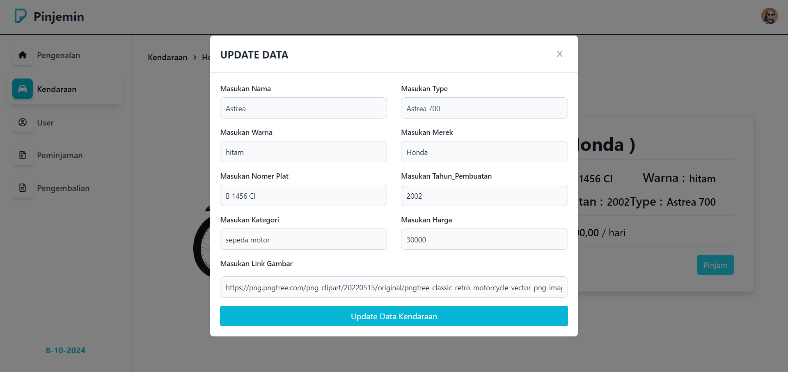

# WEBSITE ADMIN KELOLA PEMINJAMAN KENDARAAN
<br>

## Deskripsi Projek 

**Sistem Peminjaman Kendaraan** adalah sebuah Website responsif yang dirancang untuk memudahkan pengelolaan data Peminjaman Kendaraan yang dijalankan oleh Admin menggunakan React JS. Website ini memungkinkan Admin untuk memanage data peminjaman dengan lebih cepat dan efisian.


## Dependecies / Teknologi yang digunakan

1. **React**

    Library / Framework JS

    ```bash
   npx create-react-app (nama Folder)
    ```

2. **axios**

    Untuk Melakukan Pemasangan Service API

    ```bash
    npm i axios
    ```

3. **react-icons**

    Pendukung Icon

    ```bash
    npm i react-icons
    ```

4. **react-router-dom**

    Pembuatan Routing

    ```bash
    npm i react-router-dom
    ```
5. **moment**

    Perhitungan Waktu 

    ```bash
    npm i moment
    ```
6. **html2canvas & jspdf**

    Menyeleksi dan Melakukan Convert ke Bentuk PDF

    ```bash
    npm i html2canvas jspdf
    ```
7. **react-select**

    Digunakan Untuk Pembuatan Input Select

    ```bash
    npm i react-select
    ```
8. **tailwind**

    utility UI

    [tailwind](https://tailwindcss.com/docs/guides/create-react-app)


    <br>
    

## Note
Data user = Data Client

<br>


<br>


## Hal Yang Berkaitan


- **Login**


- **Register**


- **Pengenalan / Pendahuluan**


- **Kendaraan**


- **Per-Kendaraan**


- **Modal Update Kendaraan**


- **Modal Add Peminjaman**


- **Modal Add Pengembalian**


- **Table User**


- **Modal Add User**


- **Modal Update User**


- **Table Peminjaman**


- **Table Pengembalian**


- **Invoice**


- **Page 404**


<br>


## Kontribusi

Jika Anda ingin berkontribusi pada projek ini, silakan lakukan pull request dengan perubahan yang Anda inginkan. Pastikan perubahan Anda sesuai dengan tujuan dan struktur projek ini.

```
    Buat Code Disini
```

<br>

## Kontak

- **Nama:** Syahreza Imam Wahyudi
- **Email:** [syahrezaimamwahyudi976@gmail.com](mailto:syahrezaimamwahyudi976@gmail.com)
- **Website:** [www.https://github.com/Syahrezaimamw.com](https://github.com/Syahrezaimamw)

<br>


 


